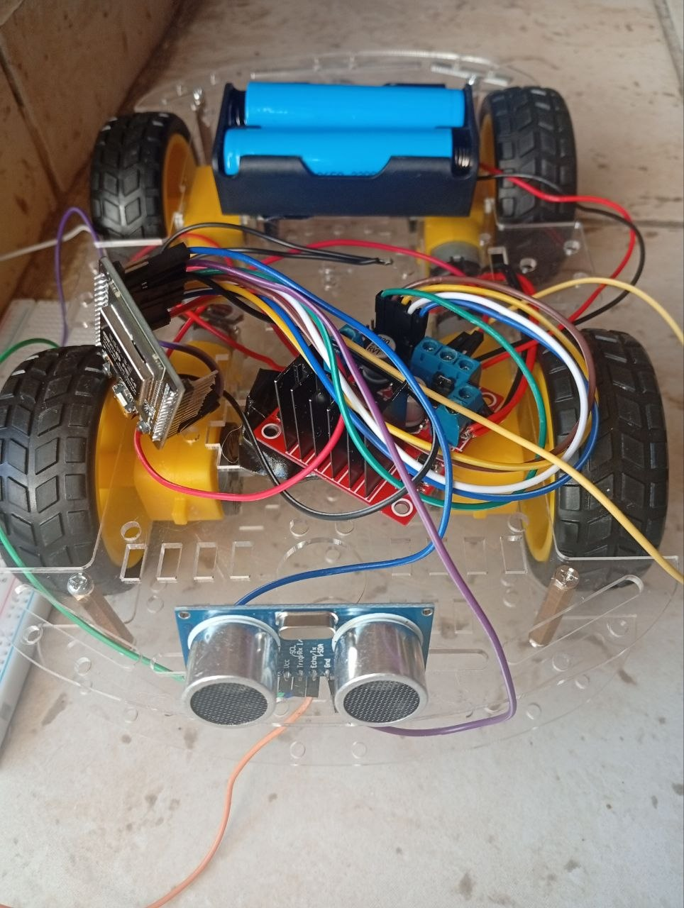

# IoT Smart Car with Obstacle Detection 🚗

[Watch Video Demo](Desktop/IotProjects/images/video_2026-07-19_12-20-47.mp4)
## Description
This project is an IoT-based smart car developed using ESP32, L298N motor driver, and HC-SR04 ultrasonic sensor. The car can detect obstacles and automatically change its direction to avoid collisions.

## Components
- ESP32 Development Board
- L298N Motor Driver
- HC-SR04 Ultrasonic Sensor
- DC Motors
- Car Chassis
- Battery Supply

## Features
- Obstacle detection using ultrasonic sensor
- Automatic movement control
- Distance measurement in real time
- Motor speed control using PWM

## Technologies
- Arduino IDE
- Embedded C/C++
- ESP32

## Pin Configuration

| Component | ESP32 Pin |
|---|---|
| TRIG | GPIO 5 |
| ECHO | GPIO 18 |
| ENA | GPIO 25 |
| IN1 | GPIO 26 |
| IN2 | GPIO 27 |
| ENB | GPIO 33 |
| IN3 | GPIO 14 |
| IN4 | GPIO 12 |

## Project Files
- `code.ino` : Arduino code for controlling the smart car
- `images/` : Project photos and videos

## Author
Razan Hassoun
